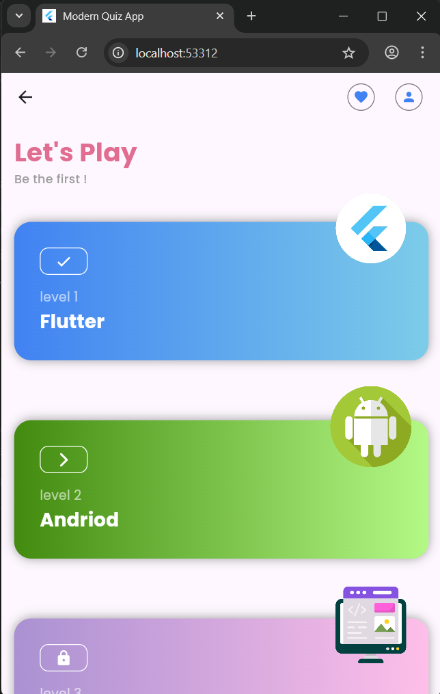
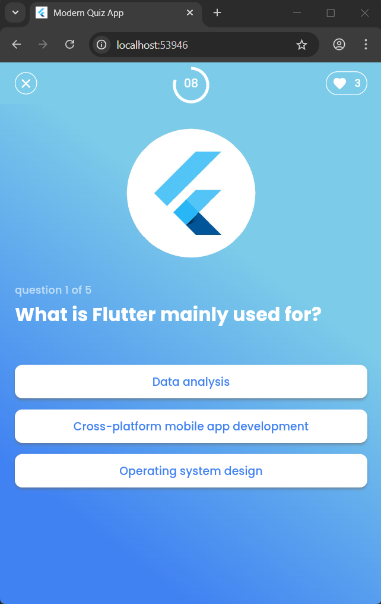
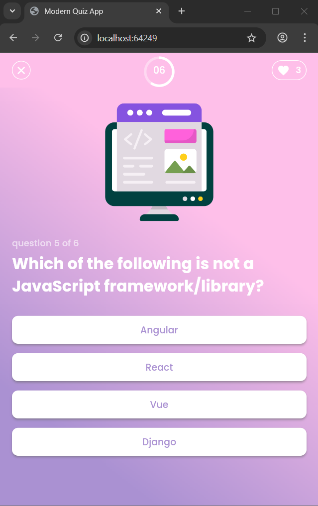
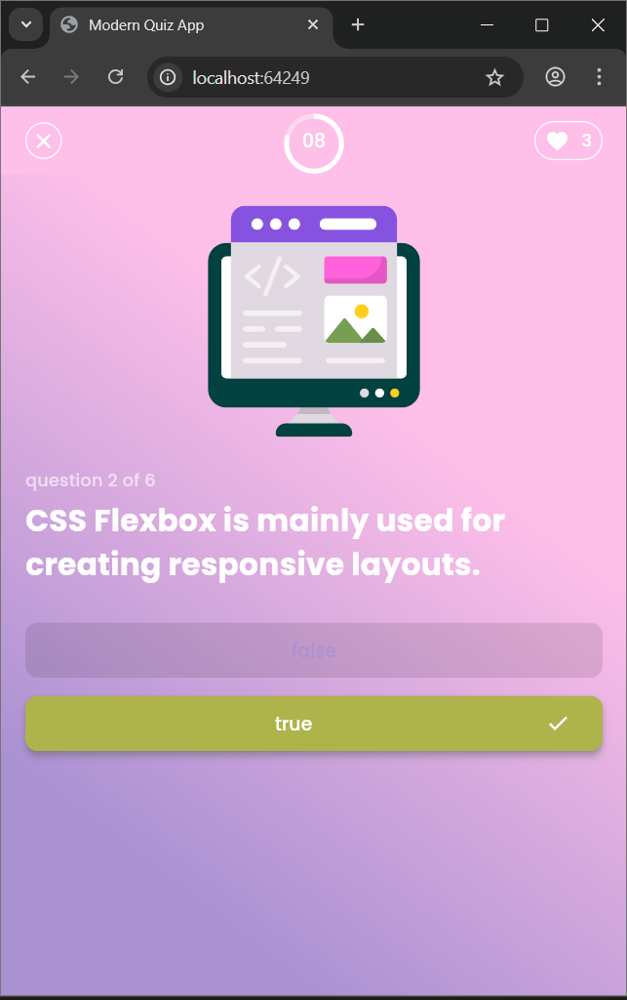
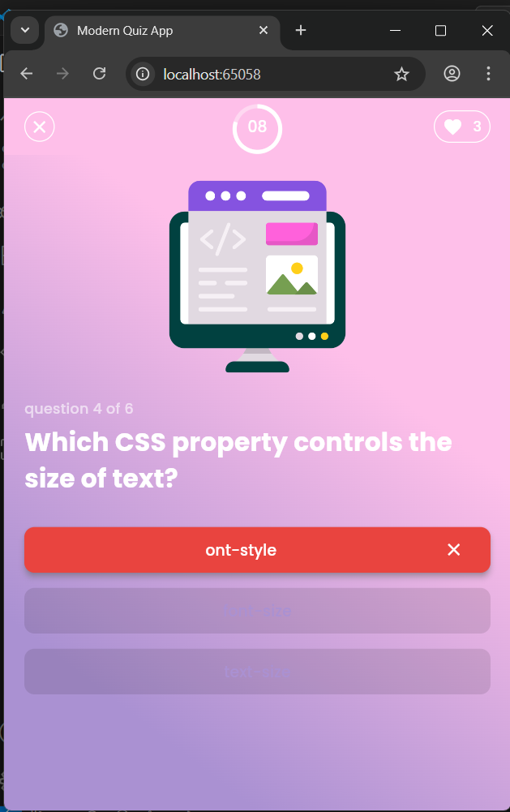
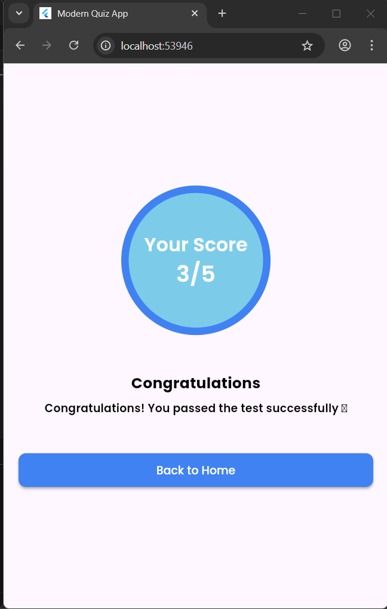
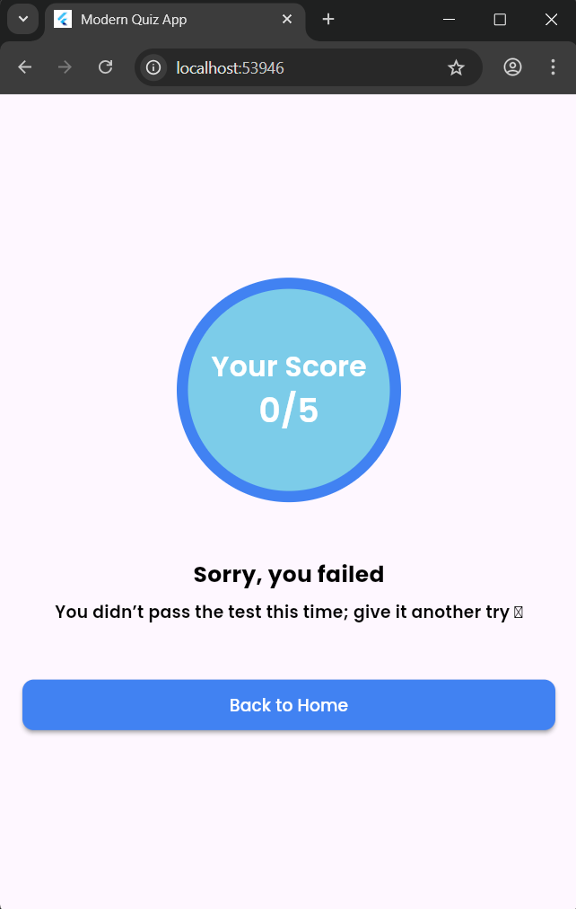

# Modern Quiz App UI 🎓🚀


---

## Project Introduction 🎯
A modern quiz application built with **Flutter** and **Dart**.  
It includes interactive quiz pages, result screens, and a clean modern UI.  
The project is structured with reusable widgets, organized logic, and assets for a professional design.

---

## Technologies Used 💻
- **Language**: Dart  
- **Framework**: Flutter  

---

## Widgets Overview 🔧

- **SingleChildScrollView**: Makes content scrollable when overflow occurs.  
- **Padding**: Adds spacing around widgets.  
- **Column / Row**: Arrange widgets vertically or horizontally.  
- **Align**: Positions a widget inside its parent.  
- **Text** & **TextStyle**: Display and style text.  
- **SizedBox**: Adds spacing or fixed size between widgets.  
- **ListView.builder**: Dynamically render scrollable lists.  
- **Stack** & **Positioned**: Overlay widgets and control their exact position.  
- **Image.asset**: Load and display local images.  
- **Container**: Flexible box for layout, styling, and decoration.  
- **Scaffold**: Basic page structure with AppBar, body, etc.  
- **LinearGradient**: Create gradient background effects.  
- **OutlinedButton.icon**: Button with an icon and text.  
- **OutlinedButton.styleFrom**: Customize OutlinedButton style.  
- **ElevatedButton**: Raised button for actions.  
- **AppBar**: Top navigation bar.  
- **CircleBorder**: Circular button shape.  
- **BorderSide**: Define border width and color.  
- **Icon**: Show icons inside UI.  
- **Expanded**: Expand widget to fill available space.  
- **CircularProgressIndicator**: Loading or progress indicator.  
- **Circular CountDown** (custom widget): Timer for quizzes ⏱️.  
- **Timer.periodic**: Execute actions repeatedly after fixed intervals.  
- **Future.delayed**: Run code after a delay (used in navigation/timers).  
---

## Key Features 🛠️
- Multiple Quiz Pages with dynamic data  
- **Countdown Timer** for quizzes ⏱️  
- Organized results pages  
- Custom UI widgets (countdown, card)  
- Well-structured assets and constants management  
- Modern clean design with images and icons  

---

## Code Snippets 📜

### Countdown Timer Example ⏱️
```dart
import 'dart:async';

int start = 10; // seconds
late Timer timer;

void startTimer() {
  timer = Timer.periodic(Duration(seconds: 1), (t) {
    if (start > 0) {
      start--;
      print("Time left: $start");
    } else {
      t.cancel();
      // Navigate after delay
      Future.delayed(Duration(seconds: 1), () {
        print("Time's up! Navigating to result page...");
      });
    }
  });
}

```

## Project Structure 📂 
The project follows a clean, organized directory structure:

```plaintext
lib
├─ classes
│  ├─ question.dart              # Question model
│  └─ questions_model.dart       # Quiz data & logic
│
├─ constants
│  ├─ colors.dart                # App color palette
│  ├─ paths.dart                 # Asset paths
│  └─ strings.dart               # App text constants
│
├─ custom widget
│  ├─ circular_count_down.dart   # Countdown timer widget
│  └─ custom_card.dart           # Custom card design
│
├─ pages
│  ├─ home_page.dart             # Home screen
│  ├─ quiz_page.dart             # Quiz UI
│  ├─ result_page.dart           # Results screen
│  └─ section_description_page.dart # Section descriptions
│
└─ main.dart                     # App entry point

```

## Screenshots 📸

### Quiz App Icon


### 1) Home Page & Quiz Page
| Home Page | Quiz Page |
| --- | --- |
|  |  ||  |

### 2) Quiz Page Correct / Wrong Answer
| Quiz Page in Choose Correct Answer | Quiz Page in Choose Wrong Answer |
| --- | --- |
|  |  |

### 3) Result Page
| Result Page in Concongratulations | Result Page in Failed |
| --- | --- |
|  |  |

---

## Acknowledgements 🙌
- [Flutter Documentation](https://docs.flutter.dev/)  
- [Dart Language](https://dart.dev/)  

---


